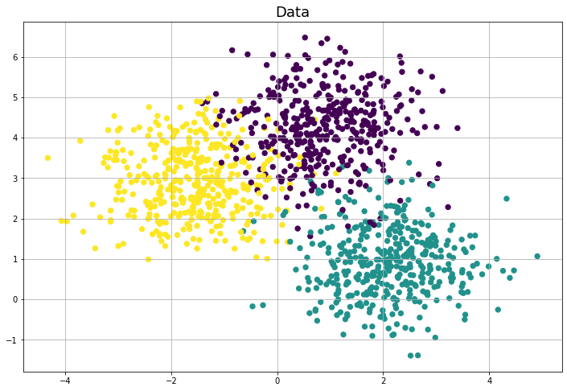
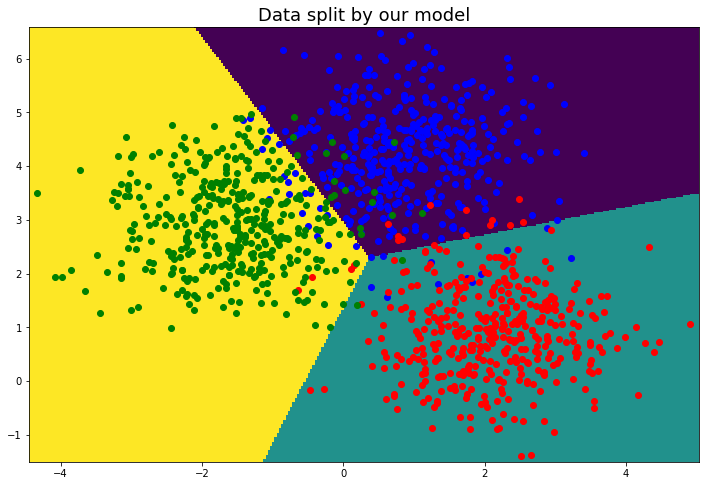

## A quick reminder of the mathematics of logistic regression

Imagine that we have $N$ people for each of whom we are trying to predict something from a certain list (for example, which of the $T$ online school courses a person will like the most). Each person is characterized by $M$ features (e.g., age, weight, height, GPA in high school, etc.).

Thus, we have:

feature matrix - $\textbf{X}$ with the shape - $N \times (M + 1)$. 1 is added to m to account for the bias term;

weight matrix - $\textbf{W}$ with the shape - $(M + 1) \times T$. Similarly, 1 is added to m to account for the bias term.

Further, for all points from the dataset, we want to get the probability of belonging to each class. Thus, we consider the probability matrix - $\textbf{P}$ with the shape - $N \times T$:

$$ P_{ij} = \exp{(- \textbf{X} \textbf{W})_{ij}} \Big{/} \sum_{k=0}^{T} \exp{(- \textbf{X} \textbf{W})_{ik}} $$

To compare the obtained probabilities with the real ones, we consider the negative log-likelihood loss, which in a simplified form, looks like this:

$$ Loss( \textbf{W} ) = \frac{1}{N} \cdot Tr( \textbf{X} \textbf{W} \textbf{Y}_{oh}^{T} ) + \frac{1}{N} \cdot \sum_{i=1}^{N} \ln{ \sum_{k=0}^{T} \exp{(- \textbf{X} \textbf{W})_{ik}} } + \lambda \cdot || \textbf{W} ||^{2} $$

and its gradient:

$$\nabla_{\textbf{W}} Loss( \textbf{W} ) = \frac{1}{N} \cdot \textbf{X}^{T} \textbf{Y}_{oh} - \frac{1}{N} \cdot \textbf{X}^{T} \textbf{P} + 2 \lambda \cdot \textbf{W}$$

where $\lambda$ is the $L2$ regularization parameter.

## Visualization and experiment results

To show the performance of our model, we will take a simple system of three classes and try to separate its elements correctly. So, for this case, the parameter values are  $N = 500$, $M = 2$ and $T = 3$. Let's look how out model performs on the data:

 
&nbsp; &nbsp; &nbsp; &nbsp;
 

Here on the left is the datapoints, colors indicates classes. On the right we have shown te decision boundaries of our model. Also note that we have divided the data into train and test sets with proportion 80% and 20%. The model is fitted on the train set and the predictions on the test set have  accuracy score of ~ 94%. This is consistent with the result of the official sklearn logistic regression model.
